## Project 5: Lights, Camera

Please fill this out for Lights, Camera only. The project handout can be found [here](https://cs1230.graphics/projects/realtime/1).

### Output Comparison

Run the program, open the specified `.json` file, follow the instructions to set the parameters, and save the image with the specified file name using the "Save image" button in the UI. It should automatically suggest the correct directory - again, be sure to follow the instructions in the left column to set the file name. Once you save the images, they will appear in the table below.

> If your program can't find certain files or you aren't seeing your output images appear, make sure to: 
>
> 1. Set your working directory to the project directory
> 2. Clone the `scenefiles` submodule. If you forgot to do this when initially cloning this repository, run `git submodule update --init --recursive` in the project directory

> Note: once all images are filled in, the images will be the same size in the expected and student outputs.

|                                           File/Method To Produce Output                                            |                                                     Expected Output                                                     |                                                                     Your Output                                                                     |
| :----------------------------------------------------------------------------------------------------------------: | :---------------------------------------------------------------------------------------------------------------------: | :-------------------------------------------------------------------------------------------------------------------------------------------------: |
|                Input: `unit_cone.json` Output: `unit_cone.png` Parameters: (5, 5, 0.1, 100)                |            |            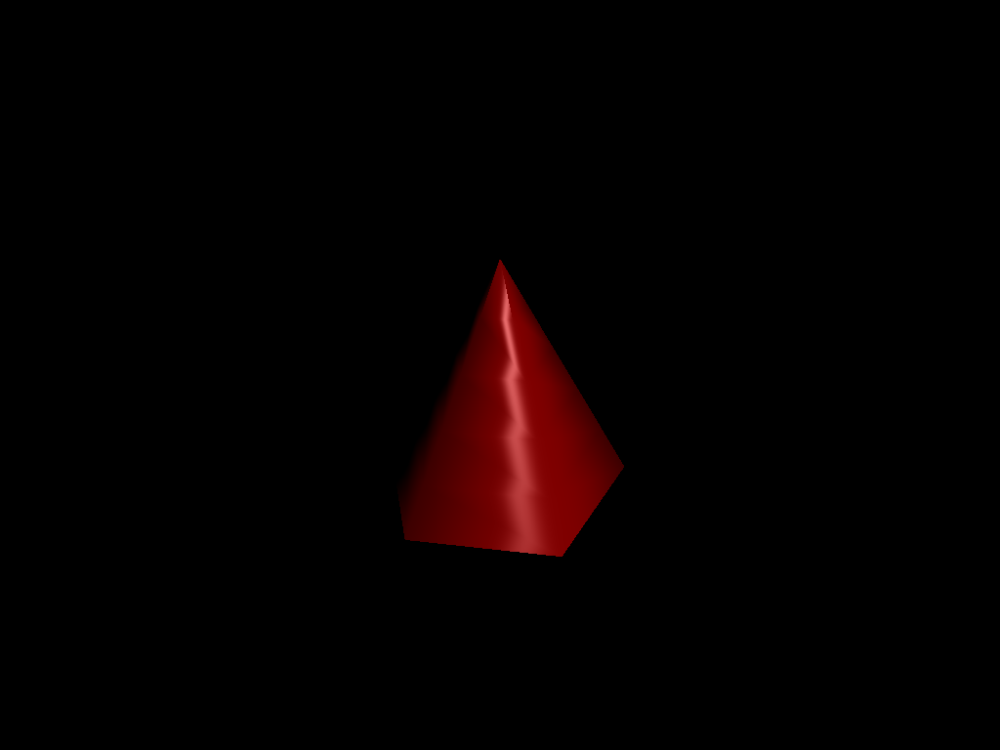            |
|            Input: `unit_cone_cap.json` Output: `unit_cone_cap.png` Parameters: (5, 5, 0.1, 100)            |        |        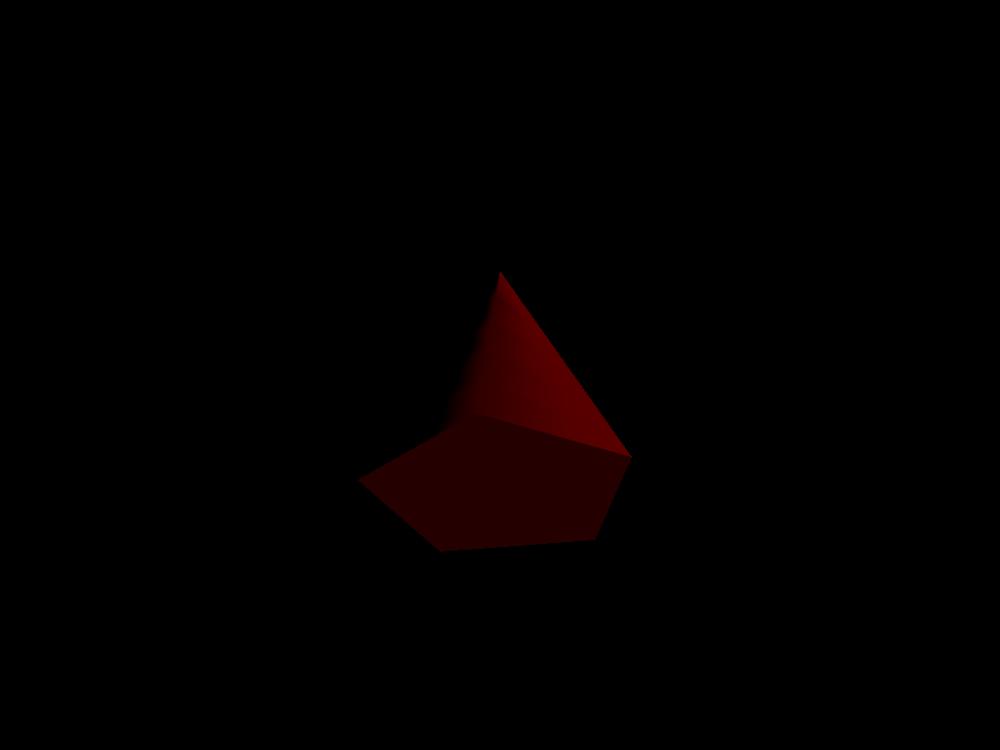        |
|               Input: `unit_cube.json` Output: `unit_cube.png`  Parameters: (5, 5, 0.1, 100)                |            |            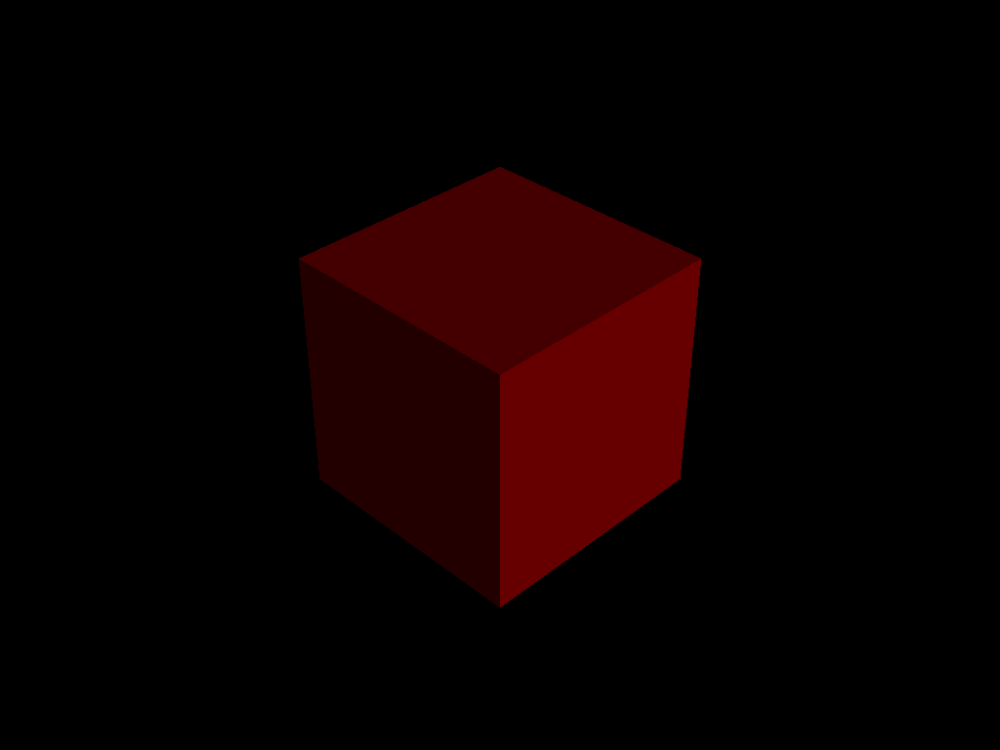            |
|            Input: `unit_cylinder.json` Output: `unit_cylinder.png` Parameters: (5, 5, 0.1, 100)            |        |        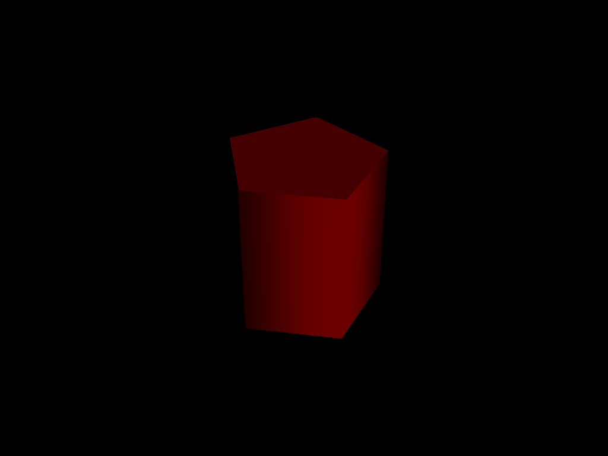        |
|              Input: `unit_sphere.json` Output: `unit_sphere.png` Parameters: (5, 5, 0.1, 100)              |          |          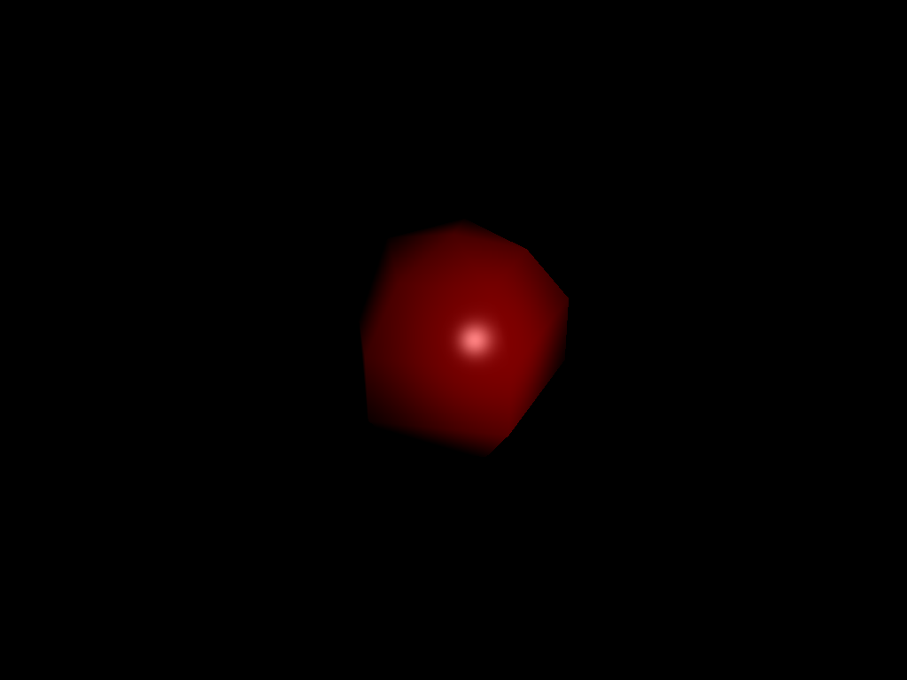          |
|          Input: `unit_cone.json` Output: `unit_cone_min.png` Parameters: (**1**, **3**, 0.1, 100)          |            |        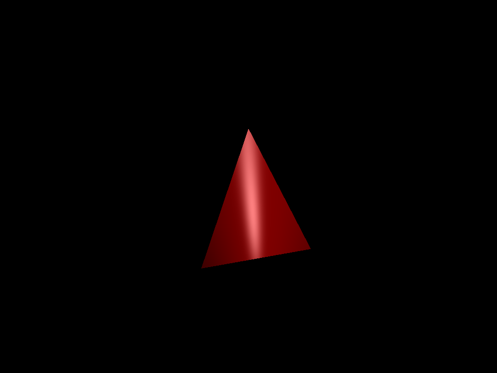        |
|      Input: `unit_cone_cap.json` Output: `unit_cone_cap_min.png` Parameters: (**1**, **3**, 0.1, 100)      |        |        |
|          Input: `unit_cube.json` Output: `unit_cube_min.png` Parameters: (**1**, **1**, 0.1, 100)          |            |                |
|      Input: `unit_cylinder.json` Output: `unit_cylinder_min.png` Parameters: (**1**, **3**, 0.1, 100)      |        |    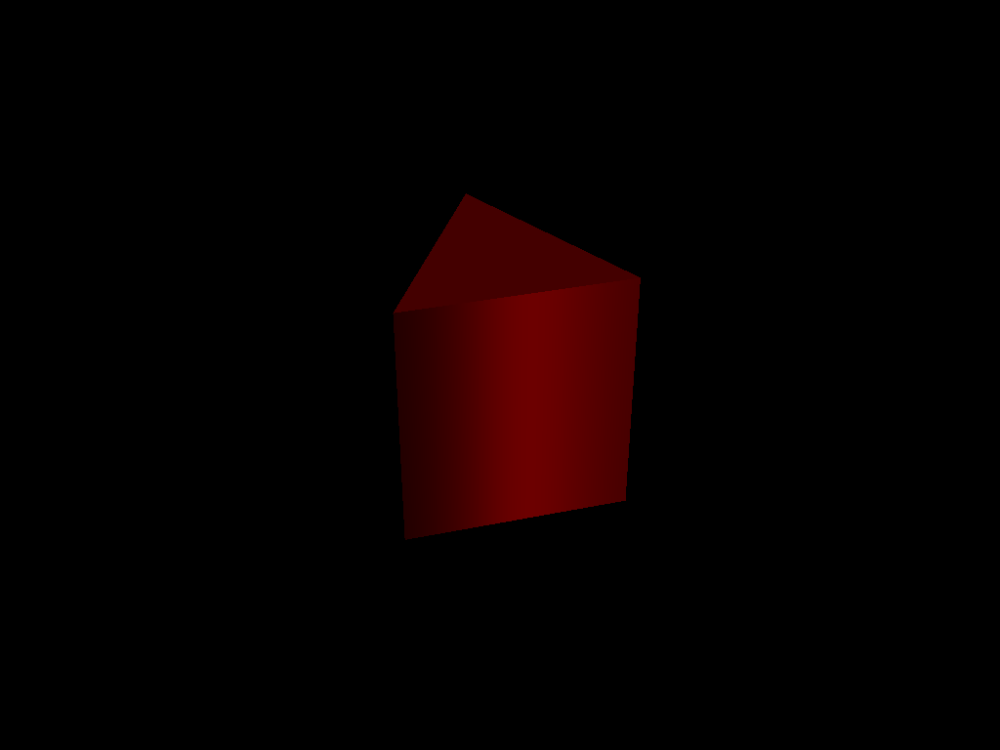    |
|        Input: `unit_sphere.json` Output: `unit_sphere_min.png` Parameters: (**2**, **3**, 0.1, 100)        |          |            |
|           Input: `parse_matrix.json` Output: `parse_matrix.png` Parameters: (**3**, 5, 0.1, 100)           |         |         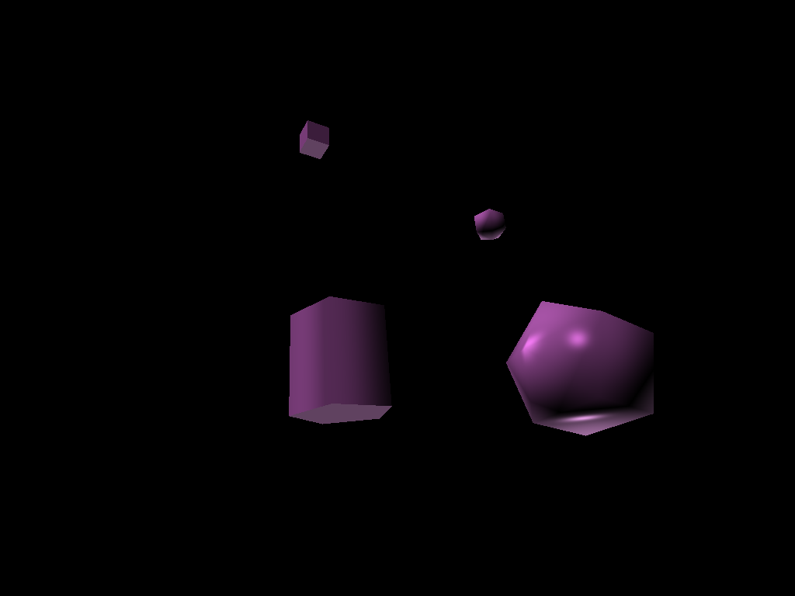         |
|            Input: `ambient_total.json` Output: `ambient_total.png` Parameters: (5, 5, 0.1, 100)            |        |                |
|            Input: `diffuse_total.json` Output: `diffuse_total.png` Parameters: (5, 5, 0.1, 100)            |        |        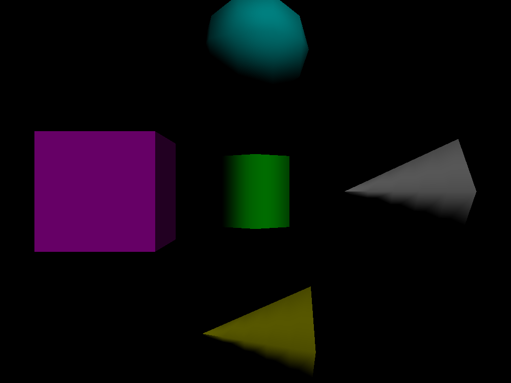        |
|           Input: `specular_total.json` Output: `specular_total.png` Parameters: (5, 5, 0.1, 100)           |       |              |
|              Input: `phong_total.json` Output: `phong_total.png` Parameters: (5, 5, 0.1, 100)              |          |                    |
|      Input: `directional_light_1.json` Output: `directional_light_1.png` Parameters: (5, 5, 0.1, 100)      |  |    |
| Input: `directional_light_2.json` Output: `directional_light_2.png` Parameters: (**10**, **10**, 0.1, 100) |  |  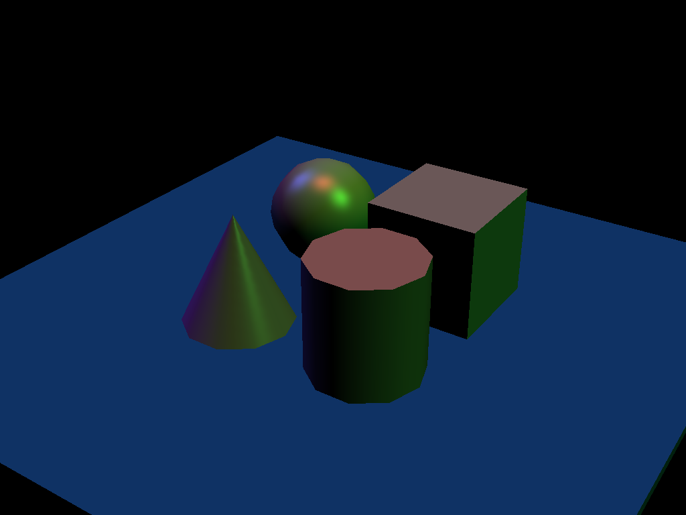  |
|      Input: `phong_total.json` Output: `phong_total_near_far.png` Parameters: (5, 5, **9.5**, **12**)      |  | 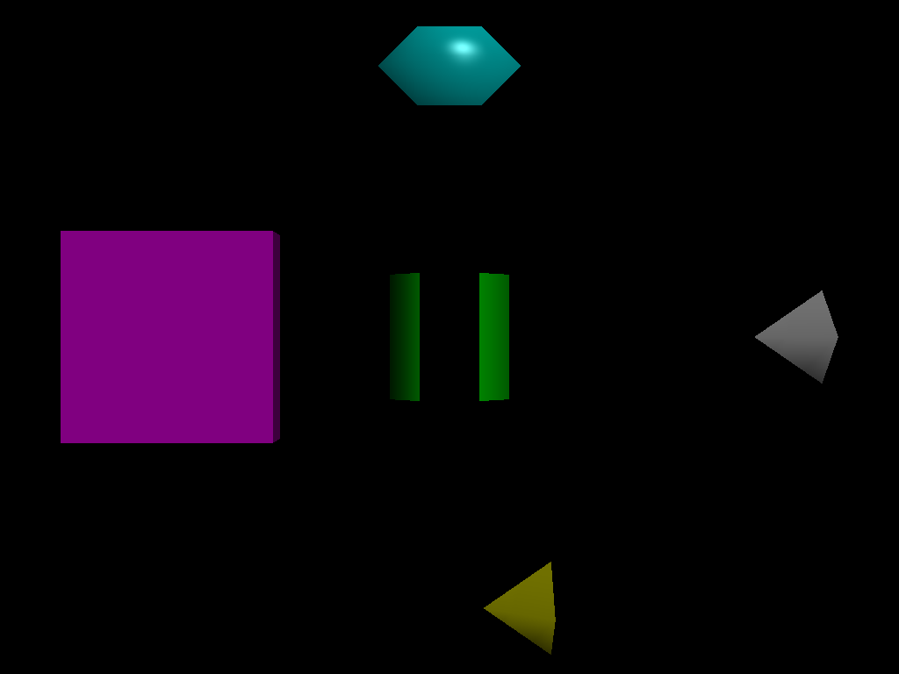 |
|      Input: `directional_light_1.json` Output: `directional_light_1_near_far.png` Parameters: (**25**, **25**, **8**, **10**)      |  | 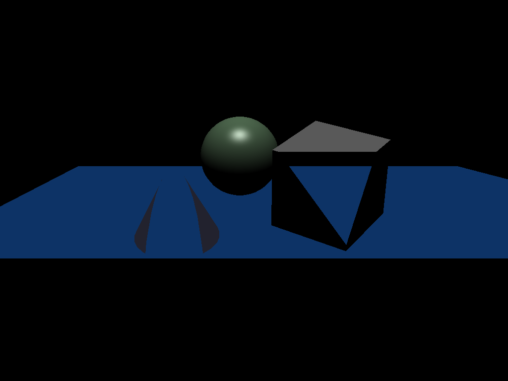 |

### Design Choices
I use only one vbo and one vao for the sake of efficiency. I store the data for al four pimiTypes one after another in the vbo, and when I need to fetch them, I use an offset. 

### Collaboration/References
N/A

### Known Bugs
N/A

### Extra Credit
N/A
